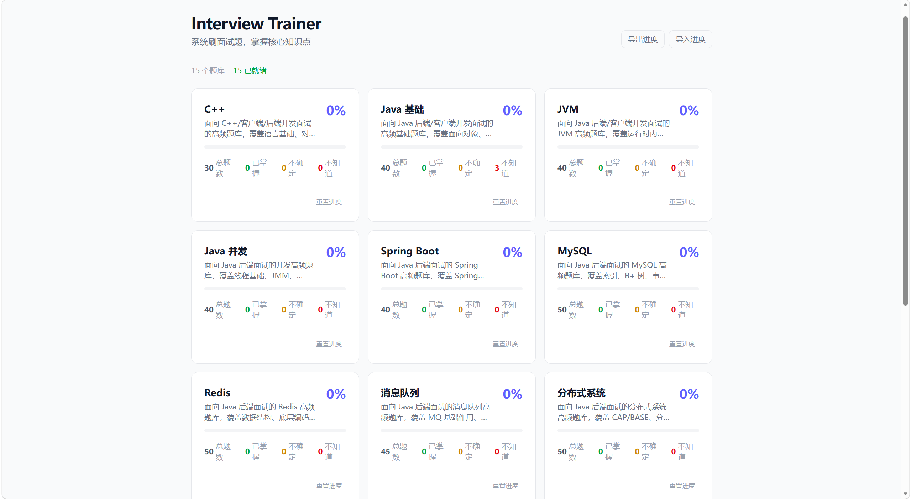

# Interview Trainer

一个面向 PC 端的面试刷题网站，支持分题库刷题、进度追踪、多种刷题模式和 Markdown 答案渲染。



---

## 功能特性

**首页**
- 展示所有题库卡片，显示总题数、已掌握、不确定、不知道数量及完成进度
- 支持重置单个题库进度
- 支持导出 / 导入刷题进度 JSON，防止换电脑后丢失

**刷题页**
- 答案默认隐藏，点击状态按钮后显示
- 六种刷题模式：智能刷题 / 只刷未做 / 只刷不确定 / 只刷不知道 / 顺序全刷 / 随机刷题
- 右侧题目列表面板，显示每题状态，点击可跳转
- 答案支持 Markdown 渲染（代码块、列表、表格等）
- 键盘快捷键：`1` 知道、`2` 不确定、`3` 不知道、`Enter` 下一题

**题库管理**
- JSON 格式题库，放入 `public/question-banks/` 即可生效
- 加载时自动校验字段完整性和 ID 唯一性
- 文件缺失、JSON 格式错误、字段校验失败分别给出明确提示

---

## 题库列表

| 题库 | 描述 |
|------|------|
| C++ | C++ 语言基础、对象模型、内存管理 |
| Java 基础 | 基础语法、面向对象、集合、泛型、反射 |
| JVM | 内存区域、对象创建、类加载、GC、调优 |
| Java 并发 | 线程、锁、JMM、并发工具类 |
| Spring Boot | IoC、AOP、自动配置、常用注解 |
| MySQL | 索引、B+ 树、事务、MVCC、锁、SQL 优化 |
| Redis | 数据结构、持久化、缓存、分布式锁 |
| 消息队列 | MQ 基础、Kafka、RocketMQ |
| 分布式系统 | CAP、BASE、分布式事务、一致性 |
| 操作系统 | 进程线程、虚拟内存、IO 模型、死锁 |
| 计算机网络 | TCP/IP、HTTP/HTTPS、三次握手、四次挥手 |
| 算法 | 排序、动态规划、图、常见面试题 |
| 设计模式 | 创建型、结构型、行为型常见模式 |
| Linux & Git | 常用命令、Shell、Git 操作 |
| 客户端 | Android / iOS / 跨端常见面试题 |

---

## 快速开始

```bash
# 安装依赖
npm install

# 启动开发服务器
npm run dev

# 生产构建
npm run build
```

---

## 添加题库

将 JSON 文件放入 `public/question-banks/<id>.json`，并在 `src/data/banks.ts` 的 `BANK_IDS` 数组中注册对应 ID。

题库 JSON 格式：

```json
{
  "id": "java-basic",
  "name": "Java 基础",
  "description": "题库描述",
  "questions": [
    {
      "id": "java-basic-001",
      "question": "问题内容",
      "answer": "答案内容，支持 Markdown",
      "difficulty": "easy",
      "tags": ["Java", "基础"]
    }
  ]
}
```

`difficulty` 可选值：`easy` / `medium` / `hard`

---

## 技术栈

- React 19 + TypeScript
- Vite 8
- Tailwind CSS 4
- react-router-dom v7
- react-markdown + remark-gfm

---

## 刷题进度

进度保存在浏览器 `localStorage`，可通过首页「导出进度」按钮备份为 JSON 文件，在新设备上通过「导入进度」恢复。
